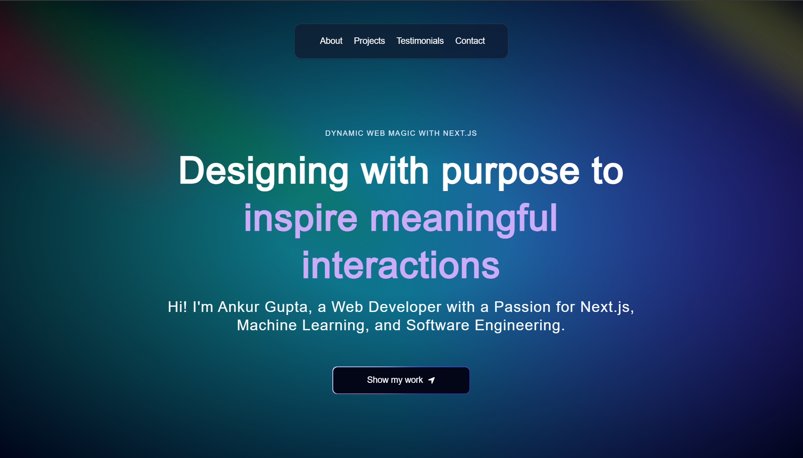

<div align="center">
  <br />
    <a href="https://youtu.be/your-video-link" target="_blank">
      
    </a>
  <br />

  <div>
    
    
    
    
  </div>

  <h3 align="center">Ankur Gupta's Modern Portfolio</h3>

   <div align="center">
     This is my personal portfolio showcasing my skills and projects.
    </div>
</div>

## 📋 Table of Contents

1. [Introduction](#introduction)
2. [Tech Stack](#tech-stack)
3. [Features](#features)
4. [Quick Start](#quick-start)

## 🤖 Introduction

Built with Next.js for handling the user interface, Three.js for rendering 3D elements, Framer motion for beautiful animations, and styled with TailwindCSS, this portfolio demonstrates my skills in a unique manner that creates a lasting impact.

## ⚙️ Tech Stack

- Next.js
- Three.js
- Framer Motion
- Tailwind CSS

## 🔋 Features

👉 **Hero**: Captivating introduction featuring a spotlight effect and dynamic background.

👉 **Bento Grid**: Modern layout presenting personal information.

👉 **3D Elements**: Interactive 3D design elements.

👉 **Responsiveness**: Seamless adaptability across all devices.

## 🤸 Quick Start

**Prerequisites**
- Git
- Node.js
- npm

**Cloning the Repository**
```bash
git clone https://github.com/7007259Ankur/My-Website.git
cd My-Website


Installation

bash
npm install
Running the Project

bash
npm run dev
Open http://localhost:3000 in your browser.

